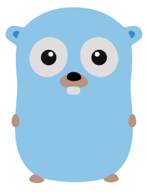

## Profile
### About Me
- A beginner in programming
- Interested in Backend Development 
- Currently pursuing a bachelor's degree in Computer Science
- Aiming to become a fully fledged developer

### My Socials

### Languages and Tools

